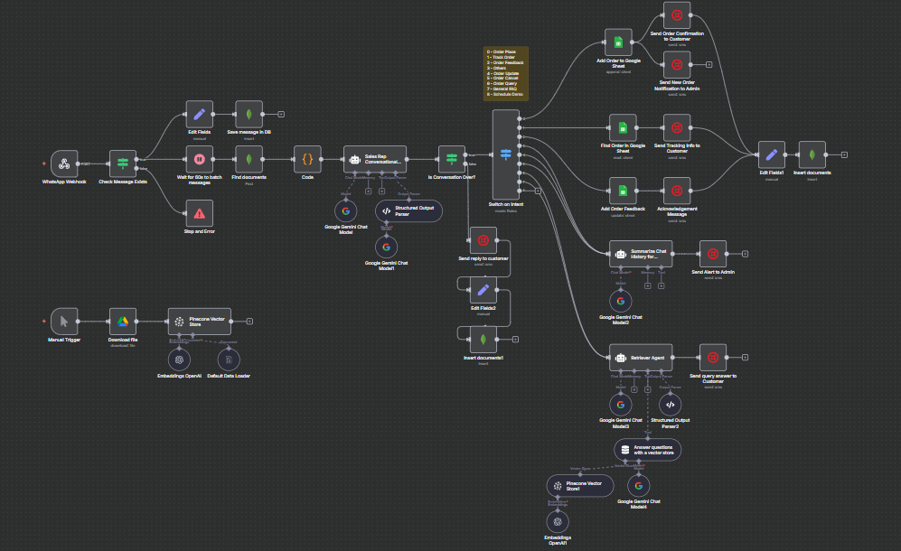

# 🤖 Smart Conversational Social Commerce Automation  

Built with **n8n**, **Twilio WhatsApp API**, and **Pinecone Vector DB**  

---

## 🌎 Business Problem  

Small businesses heavily rely on **WhatsApp & Instagram DMs** for their sales funnel – from catalog browsing to enquiry, negotiation, order placement, delivery updates, and after-sales support.  

This leads to challenges:  
- ❌ Missed enquiries due to manual tracking.  
- ❌ No structured order management or scheduling system.  
- ❌ Inefficient reminders and follow-ups.  
- ❌ Lack of a centralized conversation history for customer interactions.  

**Impact:** Lost revenue, poor customer experience, and operational inefficiency.  

---

## 🚀 The Solution  

A **Smart Conversational Agent Layer** on top of WhatsApp, using **n8n workflows** integrated with:  
- 📩 **Twilio WhatsApp Business API** – Two-way messaging.  
- 📊 **Google Sheets** – Lightweight CRM & order management.  
- 📅 **Google Calendar** – Scheduling automation.  
- 📚 **Pinecone Vector DB + LLMs** – Retrieval-Augmented Generation (RAG).  
- 🗄️ **MongoDB** – Persistent conversation history.  

✅ Automates **70–80%** of repetitive tasks while keeping a **human-in-the-loop** for payments, escalations, and exceptions.  

---

## 🖼️ Workflow Overview  

Here’s how the **end-to-end smart conversational social commerce workflow** looks in action:  

  

---

## 🔄 End-to-End Flow  

1. **Discovery & Enquiry**  
   - LLM auto-replies using RAG from FAQs & Catalog (Pinecone embeddings).  
   - Escalates to human admin if answer not found.  

2. **Order Placement**  
   - Agent collects order details → validates → stores in Google Sheets → generates Order ID.  
   - Sends structured confirmation to customer.  

3. **Scheduling**  
   - Integrates with Google Calendar.  
   - Suggests available slots, auto-books on confirmation, notifies admin.  

4. **Order Tracking & Updates**  
   - Syncs order status from Google Sheets.  
   - Sends automated WhatsApp updates (Confirmed → Packed → Shipped → Delivered).  

5. **Payments & Invoices**  
   - Agent notifies human admin for payment follow-up.  
   - LLM **does not handle sensitive financial actions**.  

6. **After-Sales Engagement**  
   - Automated follow-up messages after delivery.  
   - Captures feedback & stores in CRM.  

---

## 🧠 Agent Types  

- **Enquiry Agent** – Handles FAQs, logs enquiries, routes escalations.  
- **Order Agent** – Captures, confirms, tracks orders.  
- **Scheduler Agent** – Manages booking workflows.  
- **Follow-up Agent** – Post-purchase engagement & feedback collection.  

---

## ⚖️ Human-in-the-Loop  

- 💰 Payments.  
- 📝 Order modifications (address, color, quantity).  
- ⚠️ Escalated complaints / negative feedback.  
- ❓ Unanswerable queries → auto-summarized & routed to admin via WhatsApp.  

---

## ⚙️ Technical Implementation  

### Architecture Highlights  
- **n8n Orchestrator**: Event-driven workflows with timers & intent classification.  
- **LLM Integration**: Messages batched & classified into intents:  
  order_query | order_place | order_update | order_track | order_cancel | order_feedback | schedule_demo | general_faq | other
- **RAG Pipeline**: Pinecone stores FAQs & Catalog embeddings → relevant context retrieved → LLM generates response.  
- **Data Persistence**: MongoDB stores full conversation history for continuity & auditability.  
- **Real-time Messaging**: WhatsApp (via Twilio) ensures customer engagement without leaving chat.  

### Workflow Optimizations  
- ⏳ **Conversation Windowing**: 60s debounce timer before intent classification → avoids fragmented workflows.  
- 📝 **Conversation Summarization**: Escalations auto-summarized & pushed to human admin.  
- 🔄 **Event-Driven Sync**: Google Sheets updates trigger downstream workflows (tracking, notifications, follow-ups).  

---

## 📈 Business Impact  

- ⚡ Reduced response time by **~80%**.  
- 🤖 Automated **70–80%** of repetitive tasks.  
- ✅ Structured order tracking → seamless customer experience.  
- 📈 Increased lead conversion via faster enquiry handling.  
- 👨‍💼 Human effort optimized – admins only step in for payments & edge cases.  

---

## 🔮 Future Enhancements  

- 🌐 Multi-channel expansion (Instagram, Facebook Messenger).  
- 💳 Integration with Payment Gateways for automated invoicing.  
- 📊 Analytics Dashboard for sales & engagement insights.  
- 🧩 Fine-tuned LLMs on historical interactions for better personalization.  

---

## ✅ Result  

A **scalable, AI-driven Conversational Commerce Framework** that transforms **WhatsApp** from a simple chat tool into a **full-stack sales & support channel**.  

---
